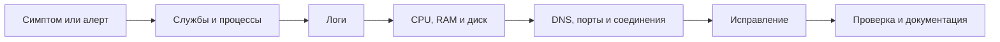

### Начинающий Linux / DevOps-инженер с опытом Python-автоматизации

Изучаю инфраструктуру через практику: разбираю Linux-системы, пишу скрипты, собираю контейнеры, настраиваю учебные CI/CD-процессы и мониторинг.

## Коротко обо мне

Я Гамид, студент из Москвы. Учусь по специальности «Информационные системы и программирование» и прохожу проектное обучение по направлению DevOps/Linux в Школе 21.

Перехожу в инфраструктуру из Python-разработки: использую программирование как инструмент для автоматизации, работы с API, обработки данных и поиска причин ошибок. Ищу стажировку или начальную позицию в Linux-администрировании, технической поддержке, сопровождении систем или DevOps.

| | |
| --- | --- |
| **Практическая база** | Linux CLI, Bash, Python, Git, Docker |
| **Нарабатываю практику** | systemd, SSH, TCP/IP, DNS, Docker Compose, GitLab CI/CD, Kubernetes, Prometheus, Grafana, PostgreSQL, SQL |
| **Что мне интересно** | эксплуатация, мониторинг, автоматизация, диагностика и документация |
| **Формат** | Москва · офис / гибрид / удалённо · полная занятость или стажировка |

## Инструменты

### Использую в учебных и личных проектах

  

### Изучаю и закрепляю на практике

`Docker Compose` · `systemd` · `SSH` · `TCP/IP` · `DNS` · `GitLab CI/CD` · `Kubernetes` · `Prometheus` · `Grafana` · `PostgreSQL` · `SQL`

> Стек разделён по реальному уровню практики: инструменты, которые только изучаю, не выданы за уверенное владение.

## Что уже умею делать на практике

- Работать в Linux с пользователями и группами, правами доступа, процессами, файловой системой, службами и журналами.
- Писать Bash- и Python-скрипты для повторяющихся операций, отчётов, обработки логов и данных.
- Собирать образы, запускать и связывать контейнеры, использовать networks, volumes и Docker Compose.
- Проверять состояние системы по логам, ресурсам, открытым портам, сетевым соединениям и состоянию служб.
- Работать с Git: ветки, коммиты, разрешение конфликтов и merge request.
- Описывать запуск проекта и последовательность диагностики так, чтобы её мог повторить другой человек.

## Проекты, которые лучше всего показывают мою практику

| Проект | Что можно проверить в репозитории |
| --- | --- |
| **[Linux Challenge Lab](https://github.com/Uzalov-Gamid/LinuxChallengeLab)** | Локальный тренажёр Linux-команд с проверкой в Ubuntu-контейнере: файлы, текстовые потоки, процессы и работа с портами. |
| **[Linux Admin Toolkit](https://github.com/Uzalov-Gamid/linux-admin-toolkit)** | Небольшие Bash/Python-утилиты для backup, отчётов по диску и процессам, анализа access-логов; есть тесты и CI-проверки. |
| **[FastAPI Monitoring Stack](https://github.com/Uzalov-Gamid/fastapi-monitoring-stack)** | Учебный стенд: сервис с метриками, Prometheus, автоматически подготовленный dashboard Grafana и запуск через Docker Compose. |
| **[DoIt v0.2](https://github.com/Uzalov-Gamid/doit-v0.2)** | Учебное Django-приложение с PostgreSQL, Docker Compose, тестами и GitHub Actions — проект, на котором практикую связь приложения и инфраструктуры. |

<b>Ещё один инфраструктурный эксперимент</b>

**[TPKT](https://github.com/Uzalov-Gamid/TPKT)** — персональная декларативная конфигурация macOS на базе nix-darwin и Home Manager. Это не Linux-дистрибутив, а эксперимент с воспроизводимой настройкой рабочей станции, конфигурацией как кодом и подробной документацией.

## Алгоритм диагностики, который отрабатываю в лабораториях

## Сейчас в фокусе

- Углубить Linux: загрузка системы, systemd, journald, права, storage и troubleshooting.
- Закрепить сети: TCP/IP, подсети, маршрутизация, DNS, DHCP, SSH, HTTP/HTTPS и TLS.
- Уверенно собирать локальные стенды в Docker Compose и диагностировать проблемы контейнеров.
- Пройти полный путь от commit до deploy в GitLab CI/CD.
- Развить базовую практику Kubernetes и мониторинга через Prometheus/Grafana.

## Обучение

- **Школа 21 от Сбера** — проектное обучение по направлению DevOps/Linux, 2025 — настоящее время.
- **Колледж мировой экономики и передовых технологий** — 09.02.07 «Информационные системы и программирование», окончание в 2028 году.

## GitHub в цифрах

  <picture>
    <source media="(prefers-color-scheme: dark)" srcset="./profile/stats-dark.svg" />
    <source media="(prefers-color-scheme: light)" srcset="./profile/stats-light.svg" />
    
  </picture>
  <picture>
    <source media="(prefers-color-scheme: dark)" srcset="./profile/languages-dark.svg" />
    <source media="(prefers-color-scheme: light)" srcset="./profile/languages-light.svg" />
    
  </picture>

Карточки ежедневно генерируются GitHub Actions и хранятся в этом репозитории, поэтому не зависят от доступности публичного сервера. Карточка языков показывает состав публичных репозиториев, а не уровень владения технологиями.

---

**Открыт к стажировкам и начальным позициям:** Linux System Administrator · Support / System Engineer · Junior DevOps

[Написать в Telegram](https://t.me/uzalovgamid) · [Написать на почту](mailto:uzalovgamid@gmail.com)

