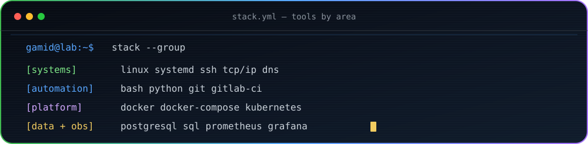
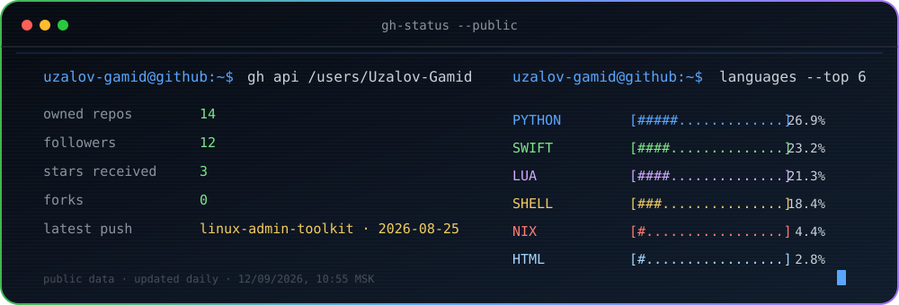

Linux-системы, контейнеризация, мониторинг и автоматизация. Рассматриваю позиции Linux-системного администратора, системного инженера и Junior DevOps.

  
  
  

## Профиль

Занимаюсь администрированием Linux, автоматизацией и эксплуатацией сервисов. Работаю с системными службами, журналами, пользователями и правами доступа, сетевыми инструментами, контейнерами и мониторингом.

Ранее занимался Python-разработкой. Сейчас использую Python и Bash для служебных скриптов, обработки данных, работы с API и автоматизации повторяющихся операций.

Практику получаю в проектах Школы 21 и собственных лабораторных стендах. Конфигурации, скрипты и инструкции храню в Git, а результаты оформляю в виде воспроизводимых проектов.

## Технологии

## Проекты

- **[Linux Challenge Lab](https://github.com/Uzalov-Gamid/LinuxChallengeLab)** — лабораторное окружение Ubuntu для практики администрирования Linux.
- **[Linux Admin Toolkit](https://github.com/Uzalov-Gamid/linux-admin-toolkit)** — Bash- и Python-скрипты для резервного копирования, проверки дисков и процессов, формирования отчётов и разбора access-логов.
- **[FastAPI Monitoring Stack](https://github.com/Uzalov-Gamid/fastapi-monitoring-stack)** — стенд с приложением, метриками Prometheus и дашбордом Grafana.
- **[DoIt v0.2](https://github.com/Uzalov-Gamid/doit-v0.2)** — Django-приложение с PostgreSQL, Docker Compose, тестами и GitHub Actions.
- **[TPKT](https://github.com/Uzalov-Gamid/TPKT)** — конфигурация macOS на базе nix-darwin и Home Manager.

## Текущий фокус

- администрирование Linux: systemd, journald, права доступа, процессы и файловые системы;
- сети: TCP/IP, подсети, DNS, DHCP, SSH, HTTP/HTTPS и TLS;
- контейнеризация и диагностика сервисов в Docker и Docker Compose;
- CI/CD, Kubernetes, Prometheus и Grafana.

## Образование

- **Школа 21 от Сбера** — направление DevOps/Linux, с 2025 года.
- **Колледж мировой экономики и передовых технологий** — 09.02.07 «Информационные системы и программирование», выпуск в 2028 году.

## GitHub

---

Рассматриваю стажировки и начальные позиции в системном администрировании, сопровождении Linux-систем и DevOps.

[Telegram](https://t.me/uzalovgamid) · [Почта](mailto:uzalovgamid@gmail.com)
