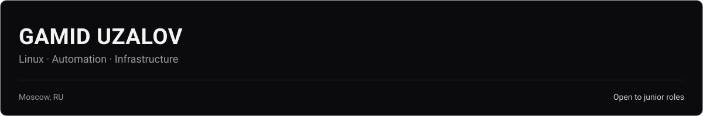
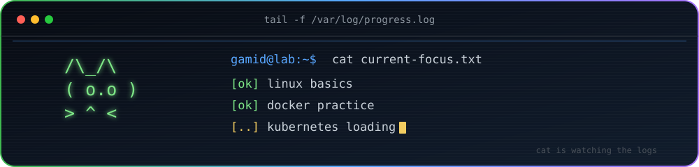
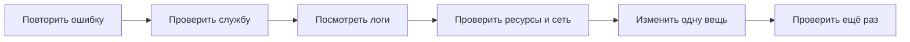
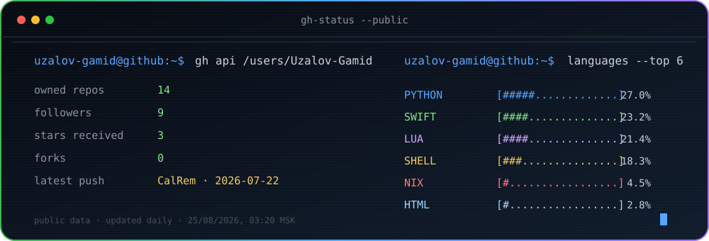

### Привет, я Гамид

Учусь работать с Linux и инфраструктурой. Сейчас ищу первую работу системным инженером, Linux-администратором или стажёром DevOps.

  
  
  

## Обо мне

Я живу в Москве, учусь в колледже и в Школе 21.

Раньше я больше занимался Python-разработкой. Со временем понял, что мне интереснее Linux, серверы и всё, что происходит вокруг приложения после написания кода. Нравится разбираться, почему что-то не запускается, смотреть логи и убирать повторяющуюся работу скриптами.

Коммерческого опыта в Linux и DevOps пока нет. Всё, что здесь показано, — мои учебные и личные проекты.

  

## Чем пользуюсь

  

- **Чаще всего:** Linux, Bash, Python, Git и Docker.
- **Есть учебная практика:** Docker Compose, systemd, SSH, TCP/IP, DNS, Prometheus, Grafana, PostgreSQL и SQL.
- **Пока разбираюсь:** GitLab CI/CD и Kubernetes.

## Мои проекты

- **[Linux Challenge Lab](https://github.com/Uzalov-Gamid/LinuxChallengeLab)** — сделал лабораторию, чтобы решать задания именно в Ubuntu, а не зависеть от различий между Linux и macOS.
- **[Linux Admin Toolkit](https://github.com/Uzalov-Gamid/linux-admin-toolkit)** — несколько Bash- и Python-скриптов для backup, отчётов по диску и процессам, а также разбора access-логов.
- **[FastAPI Monitoring Stack](https://github.com/Uzalov-Gamid/fastapi-monitoring-stack)** — локальный стенд с приложением, метриками Prometheus и dashboard в Grafana.
- **[DoIt v0.2](https://github.com/Uzalov-Gamid/doit-v0.2)** — учебное Django-приложение с PostgreSQL, Docker Compose, тестами и GitHub Actions.

Ещё один эксперимент

**[TPKT](https://github.com/Uzalov-Gamid/TPKT)** — моя конфигурация macOS через nix-darwin и Home Manager. Пробовал собрать рабочее окружение так, чтобы настройки хранились в коде и их можно было повторить.

## Как я обычно ищу проблему

Сначала стараюсь повторить ошибку. Потом иду от простого к сложному и меняю по одной вещи за раз.

## Что сейчас учу

- systemd, journald, права, процессы и файловые системы;
- TCP/IP, подсети, DNS, DHCP, SSH, HTTP/HTTPS и TLS;
- диагностику контейнеров и работу с Docker Compose;
- GitLab CI/CD, основы Kubernetes и мониторинг.

## Учёба

- **Школа 21 от Сбера** — направление DevOps/Linux, с 2025 года.
- **Колледж мировой экономики и передовых технологий** — 09.02.07 «Информационные системы и программирование», выпуск в 2028 году.

## GitHub в терминале

  

Панель обновляется каждый день. Языки показывают состав файлов в публичных репозиториях, а не мой уровень владения ими.

---

Ищу стажировку или начальную позицию: **Linux System Administrator · Support / System Engineer · Junior DevOps**

[Telegram](https://t.me/uzalovgamid) · [Почта](mailto:uzalovgamid@gmail.com)

